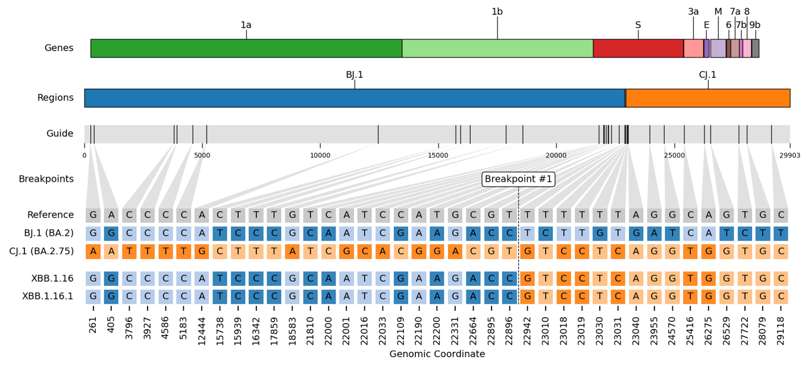

# rebar

> ❗❗❗ This is the temporary `rust` rewrite branch. ❗❗❗

[](#credits)

[](https://github.com/phac-nml/rebar/blob/master/LICENSE)
[](https://github.com/phac-nml/rebar/issues)
[](https://github.com/phac-nml/rebar/actions/workflows/install.yaml)
[](https://github.com/phac-nml/rebar/actions/workflows/examples.yaml)
[](https://github.com/phac-nml/rebar/actions/workflows/validate.yaml)

**RE**combination **BAR**code detector.

## Why rebar?

`rebar` is a command-line application that _detects_ and _visualizes_ recombination between sequences. It follows the [PHA4GE Guidance for Detecting and Characterizing SARS-CoV-2 Recombinants](https://github.com/pha4ge/pipeline-resources/blob/main/docs/sc2-recombinants.md) which outlines three steps:

1. Assess the genomic evidence for recombination.
1. Identify the breakpoint coordinates and parental regions.
1. Classify sequences as _designated_ or _novel_ recombinant lineages.

## Install

1. Binary: \*\*Coming Soon\*\*

1. Conda: \*\*Coming Soon\*\*

## Usage

### Example 1

1. Download the sars-cov-2 dataset snapshotted to the date 2023-09-21.

  ```bash
  rebar dataset download \
    --name sars-cov-2 \
    --tag 2023-09-21T12:00:00Z \
    --output-dir dataset/sars-cov-2/2023-09-21T12:00:00Z
  ```

- `--tag` can be `latest` or a date in [RFC 3339 format](https://utcc.utoronto.ca/~cks/space/blog/unix/GNUDateAndRFC3339).

1. Detect recombination in user-specified populations.

  ```bash
  rebar run \
    --dataset-dir dataset/sars-cov-2/2023-09-21T12:00:00Z  \
    --populations "AY.4.2*,BA.5.2,XBC*,XBB.1.5.1,XBL" \
    --output-dir example1
  ```

- `--populations` can include any sequence name found in the dataset `populations.fasta`. For sars-cov-2, sequence names are the designated lineages.
- The wildcard character ("\*") will include the lineage and all its descendants.
- **NOTE**: If using "\*", make sure to use quotes (ex. `--lineages "XBC*,XBB.1.16*"`)!

1. Visualize breakpoints and parental regions.

  ```bash
  rebar plot \
    --dataset-dir dataset/sars-cov-2/latest \
    --output-dir example1 \
    --plot-dir example1/plots
  ```

### Example 2

Detect recombination from an input alignment.

```bash
rebar run \
  --dataset dataset/sars-cov-2/latest \
  --alignment test/alignment.fasta \
  --output-dir example2
```

The `--alignment` must be aligned to the same reference as in the dataset `reference.fasta` (we strongly recommend [nextclade](https://github.com/nextstrain/nextclade)).

## Validate

Run `rebar` on all populations in the dataset, and validate against the expected results.

```bash
rebar run \
  --dataset-dir dataset/sars-cov-2/latest \
  --output-dir validate \
  --populations "*" \
  --threads 8
```

## Output

### Plot

Visualization of substitutions, parental origins, and breakpoints.

- Output path: `<outdir>/plots/<recombinant>_<parent_1>_<parent_2>.png`



### Table

A linelist summary of detection results.

- Output path: `<outdir>/summary.tsv`

|strain    |lineage   |clade|clade_lineage|recombinant|definition|validate|parents_lineage|parents_clade|parents_clade_lineage|breakpoints|regions                          |genome_length|dataset_name|dataset_tag|barcodes_date|barcodes_tag|tree_date |tree_tag|sequences_date|sequences_tag|
|:---------|:---------|:----|:------------|:----------|:---------|:-------|:--------------|:------------|:--------------------|:----------|:--------------------------------|:------------|:-----------|:----------|:------------|:-----------|:---------|:-------|:-------------|:------------|
|XBB.1.16  |XBB.1.16  |23B  |XBB.1.16     |XBB        |XBB.1.16  |positive|BJ.1,CJ.1      |21L,22D      |BA.2,BA.2.75         |22897:22941|261-22896\|BJ.1,22942-29118\|CJ.1|29903        |sars-cov-2  |latest     |2023-04-28   |c728b480    |2023-04-28|b2794397|2023-04-28    |6f36a61a     |
|XBB.1.16.1|XBB.1.16.1|23B  |XBB.1.16     |XBB        |XBB.1.16.1|positive|BJ.1,CJ.1      |21L,22D      |BA.2,BA.2.75         |22897:22941|261-22896\|BJ.1,22942-29118\|CJ.1|29903        |sars-cov-2  |latest     |2023-04-28   |c728b480    |2023-04-28|b2794397|2023-04-28    |6f36a61a     |

### Summary YAML

A super-detailed YAML summary of recombination detection results.

- Output path: `<outdir>/summary.yaml`

```yaml
XBB.1.16:
  substitutions: C241T,A405G,T670G,C2790T,C3037T,G4184A,...
  deletions: 11288-11296,21633-21641,21992-21994,28362-28370
  missing: 1-200,29704-29903
  lineage:
    lineage: XBB.1.16
    definition: XBB.1.16
    clade: 23B
    clade_lineage: XBB.1.16
    top_lineages: XBB.1.16.3,XBB.1.16.2,XBB.1.16.1,XBB.1.16,FU.2,FU.1
    top_lineages_subsample: XBB.1.16.3,XBB.1.16.2,XBB.1.16.1,XBB.1.16,FU.2,FU.1
    outlier_lineages:
    barcode: A1G,C44T,C241T,A405G,T670G,C2790T,C3037T,G4184A,...
    support: C241T,A405G,T670G,C2790T,C3037T,G4184A,...
    missing: A1G,C44T
    conflict_ref:
    conflict_alt:
    recombinant: XBB
    recursive: None
    edge_case: 'False'
  recombination:
    breakpoints: 22897:22941
    regions: 261-22896|BJ.1,22942-29118|CJ.1
    parent_1:
      lineage: BJ.1
      definition: BJ.1
      clade: 21L
      clade_lineage: BA.2
      ...
```

## Credits

[rebar](https://github.com/phac-nml/rebar) is built and maintained by [Katherine Eaton](https://ktmeaton.github.io/) at the [National Microbiology Laboratory (NML)](https://github.com/phac-nml) of the Public Health Agency of Canada (PHAC).

This project follows the [all-contributors](https://github.com/all-contributors/all-contributors) specification ([emoji key](https://allcontributors.org/docs/en/emoji-key)). Contributions of any kind welcome!

<table>
  <tr>
    <td align="center"><a href="https://ktmeaton.github.io"><br /><sub><b>Katherine Eaton</b></sub></a><br /><a href="https://github.com/phac-nml/rebar/commits?author=ktmeaton" title="Code">💻</a> <a href="https://github.com/phac-nml/rebar/commits?author=ktmeaton" title="Documentation">📖</a> <a href="#design-ktmeaton" title="Design">🎨</a> <a href="#ideas-ktmeaton" title="Ideas, Planning, & Feedback">🤔</a> <a href="#infra-ktmeaton" title="Infrastructure (Hosting, Build-Tools, etc)">🚇</a> <a href="#maintenance-ktmeaton" title="Maintenance">🚧</a></td>
  </tr>
</table>

Special thanks go to the following people, who are instrumental to the design and data sources in `rebar`:

- Lena Schimmel ([@lenaschimmel](https://github.com/lenaschimmel)) for the original concept of a barcode-scanning recombinant detector with [sc2rf](https://github.com/lenaschimmel/sc2rf).
- Cornelius Roemer ([@corneliusroemer](https://github.com/corneliusroemer)) for the [designated lineages](https://github.com/cov-lineages/pango-designation), [consensus sequences](https://github.com/yatisht/usher), and [Nextclade barcodes](https://raw.githubusercontent.com/corneliusroemer/pango-sequences/main/data/pango-consensus-sequences_summary.json).
- Josh Levy ([@joshuailevy](https://github.com/andersen-lab/Freyja-data)) and the [Andersen Lab](https://github.com/andersen-lab) for the [UShER barcodes](https://github.com/yatisht/usher) from [Freyja](https://github.com/andersen-lab/Freyja).
- Richard Neher ([@rneher](https://github.com/rneher)) and the [Neher Lab](https://github.com/neherlab) for python package structure, specifically [treetime](https://github.com/neherlab/treetime).

<table>
  <tr>
    <td align="center">
      <a href="https://github.com/lenaschimmel">
        <br />
        <sub><b>Lena Schimmel</b></sub>
      </a>
      <br />
      <a href="https://github.com/lenaschimmel/sc2rf" title="Ideas: sc2rf">🤔</a>
    </td>
    <td align="center">
      <a href="https://github.com/corneliusroemer">
        
        <br />
        <sub><b>Cornelius Roemer</b></sub>
      </a>
      <br />
      <a href="https://github.com/cov-lineages/pango-designation" title="Data: Lineage Designations">🔣</a>
      <a href="https://github.com/corneliusroemer/pango-sequences" title="Data: Consensus Sequences">🔣</a>
      <a href="https://github.com/corneliusroemer/pango-sequences" title="Data: Nextclade Barcodes">🔣</a>
    </td>
    <td align="center">
      <a href="https://github.com/joshuailevy">
      
        <br />
        <sub><b>Josh Levy</b></sub>
      </a>
      <br />
      <a href="https://github.com/andersen-lab/Freyja-data" title="Data: UShER Barcodes">🔣</a>
    </td>
    <td align="center">
      <a href="https://github.com/rneher">
      
        <br />
        <sub><b>Richard Neher</b></sub>
      </a>
      <br />
      <a href="https://github.com/neherlab/treetime" title="Ideas: Treetime">🤔</a>
    </td>  
  </tr>
</table>

Thanks go to the following people, who participated in the development of [ncov-recombinant](https://github.com/ktmeaton/ncov-recombinant), which `rebar` is based on:

<table>
  <tr>
    <td align="center">
      <a href="https://github.com/yatisht">
        <br />
        <sub><b>Yatish Turakhia</b></sub>
      </a>
      <br />
      <a href="https://github.com/yatisht/usher" title="Data: UShER">🔣</a>
      <a href="https://github.com/yatisht/usher" title="Ideas: UShER">🤔</a>
    </td>
    <td align="center">
      <a href="https://github.com/AngieHinrichs">
        <br />
        <sub><b>Angie Hinrichs</b></sub>
      </a>
      <br />
      <a href="https://github.com/yatisht/usher" title="Data: UShER">🔣</a>
      <a href="https://github.com/yatisht/usher" title="Ideas: UShER">🤔</a>
    </td>
    <td align="center"><a href="https://www.inspq.qc.ca/en/auteurs/2629/all"><br /><sub><b>Benjamin Delisle</b></sub></a><br /><a href="https://github.com/phac-nml/rebar/issues?q=author%3Abenjamindeslisle" title="Bug eports">🐛</a> <a href="https://github.com/phac-nml/rebar/commits?author=benjamindeslisle" title="Tests">⚠️</a></td>  
    <td align="center"><a href="https://ca.linkedin.com/in/dr-vani-priyadarsini-ikkurti-4a2ab676"><br /><sub><b>Vani Priyadarsini Ikkurthi</b></sub></a><br /><a href="https://github.com/phac-nml/rebar/issues?q=author%3Avanipriyadarsiniikkurthi" title="Bug reports">🐛</a> <a href="https://github.com/phac-nml/rebar/commits?author=vanipriyadarsiniikkurthi" title="Tests">⚠️</a></td>
    <td align="center"><a href="https://ca.linkedin.com/in/mark-horsman-52a14740"><br /><sub><b>Mark Horsman</b></sub></a><br /><a href="#ideas-markhorsman" title="Ideas, Planning, & Feedback">🤔</a> <a href="#design-markhorsman" title="Design">🎨</a></td>
    <td align="center"><a href="https://github.com/dfornika"><br /><sub><b>Dan Fornika</b></sub></a><br /><a href="#ideas-dfornika" title="Ideas, Planning, & Feedback">🤔</a> <a href="https://github.com/phac-nml/rebar/commits?author=dfornika" title="Tests">⚠️</a></td>
    <td align="center"><br /><sub><b>Tara Newman</b></sub><br /><a href="#ideas-TaraNewman" title="Ideas, Planning, & Feedback">🤔</a> <a href="https://github.com/phac-nml/rebar/commits?author=TaraNewman" title="Tests">⚠️</a></td>  
  </tr>  

</table>
