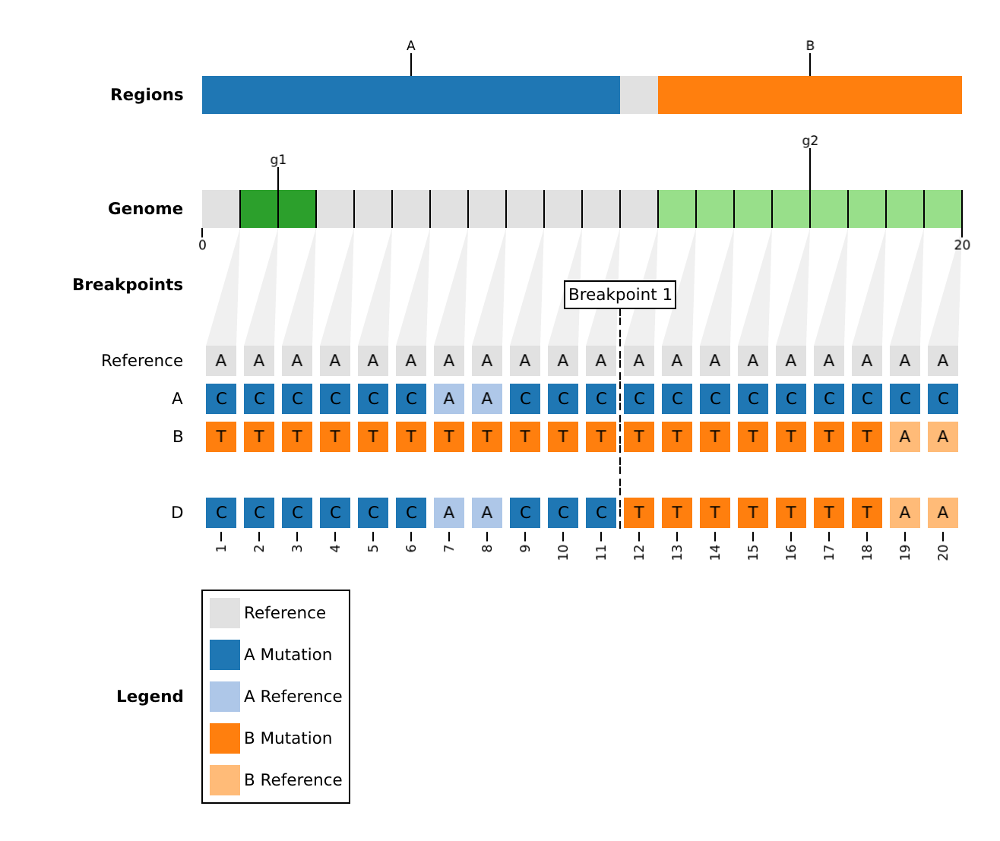

# rebar

[](#credits)
[](https://github.com/phac-nml/rebar/blob/master/LICENSE)
[](https://github.com/phac-nml/rebar/releases)
[](https://github.com/phac-nml/rebar/issues)
[](https://github.com/phac-nml/rebar/actions/workflows/test.yaml)
[](https://github.com/phac-nml/rebar/actions/workflows/nightly.yaml)

`rebar` is a **RE**combination **BAR**code detector!

## Why rebar?

1. **`rebar` _detects_ and _visualizes_ genomic recombination.**

    It follows the [PHA4GE Guidance for Detecting and Characterizing SARS-CoV-2 Recombinants](https://github.com/pha4ge/pipeline-resources/blob/main/docs/sc2-recombinants.md) which outlines three steps:

    1. Assess the genomic evidence for recombination.
    1. Identify the breakpoint coordinates and parental regions.
    1. Classify sequences as _designated_ or _novel_ recombinant lineages.

1. **`rebar` peforms generalized _clade assignment_**.

    While specifically designed for recombinants, `rebar` works on non-recombinants tool! It will report a sequence's closest known match in the dataset, as well any mutation conflicts that were observed. The linelist and visual outputs can be used to detect novel variants, such as the SARS-CoV-2 [pango-designation](https://github.com/cov-lineages/pango-designation/issues) process.

1. **`rebar` is for _exploring hypotheses_.**

    The recombination search can be customized to test your hypotheses about which parents and genomic regions are recombining. If that sounds overwhelming, you can always just use the pre-configured datasets (ex. SARS-CoV-2) that are validated against known recombinants.

![A plot of the breakpoints and parental regions for the recombinant SARS-CoV-2 lineage XBB.1.16. At the top are rectangles arranged side-by-side horizontally. These are colored and labelled by each parent (ex. BJ.1., CJ.1) and are intepreted as reading left to right, 5' to 3'. Below these regions are genomic annotations, which show the coordinates for each gene. At the bottom are horizontal tracks, where each row is a sample, and each column is a mutation. Mutations are colored according to which parent the recombination region derives from.](assets/images/XBB_BJ.1_CJ.1_22897-22941.png)

## Install

`rebar` is a standalone binary file that you can simply download and run from the command-line.

| OS      | Arch   | File                                                                                                                          | Download Count                                                                                         |
| ------- | ------ | ----------------------------------------------------------------------------------------------------------------------------- | ------------------------------------------------------------------------------------------------------ |
| Linux   | 64-bit | [rebar-x86_64-unknown-linux-musl](https://github.com/phac-nml/rebar/releases/latest/download/rebar-x86_64-unknown-linux-musl) |  |
| macOS   | 64-bit | [rebar-x86_64-apple-darwin](https://github.com/phac-nml/rebar/releases/lastest/download/rebar-x86_64-apple-darwin)             |        |
| Windows | 64-bit | [rebar-x86_64-pc-windows-gnu.exe](https://github.com/phac-nml/rebar/releases//latest/download/rebar-x86_64-pc-windows-gnu.exe) |      |
| Docker  | 64-bit | [rebar-docker.tar](https://github.com/phac-nml/rebar/releases/latest/download/rebar-docker.tar)                               |                     |

Or, download on the command-line:

```bash
wget -O rebar https://github.com/phac-nml/rebar/releases/latest/download/rebar-x86_64-unknown-linux-musl
./rebar --help
```

- Please see the [install](docs/install.md) docs for Windows, macOS, Docker, Singularity, and Conda.
- Please see the [compile](docs/compile.md) docs for those interested in source compilation.

## Usage

### Custom Dataset

A small, test dataset (`toy1`) serves as a template for creating custom datasets, and for easer visualization of the method and output.

```bash
rebar dataset download --name toy1 --tag custom --output-dir dataset/toy1
rebar run --dataset-dir dataset/toy1 --populations "*" --mask 0,0 --min-length 3 --output-dir output/toy1
rebar plot  --run-dir output/toy1 --annotations dataset/toy1/annotations.tsv
```

### SARS-CoV-2

Download a SARS-CoV-2 dataset, version-controlled to the date 2023-11-30 (try any date!).

```bash
rebar dataset download --name sars-cov-2 --tag 2023-11-30 --output-dir dataset/sars-cov-2/2023-11-30
rebar run --dataset-dir dataset/sars-cov-2/2023-11-30  --populations "AY.4.2*,BA.5.2,XBC.1.6*,XBB.1.5.1,XBL" --output-dir output/sars-cov-2
rebar plot --run-dir output/sars-cov-2 --annotations dataset/sars-cov-2/2023-11-30/annotations.tsv
```

### Other

Please see the [examples](docs/examples.md) docs for more tutorials including:

- Using your own alignment of genomes as input.
- Testing specific parent combinations.
- Performing a 'knockout' experiment.
- Validating all populations in a dataset.

Please see the [dataset](docs/dataset.md) and [run](docs/run.md) docs for more methodology.

## Output

### Linelist

A linelist summary of results (ex. `output/toy1/linelist.tsv`).

|strain      |validate|validate_details|population|recombinant|parents|breakpoints|edge_case|unique_key |regions         |genome_length|dataset_name|dataset_tag|cli_version|
|:-----------|:-------|:---------------|:---------|:----------|:------|:----------|:--------|:----------|:---------------|:------------|:-----------|:----------|:----------|
|population_A|pass    |                |A         |           |       |           |false    |           |                |20           |toy1        |custom     |0.2.0      |
|population_B|pass    |                |B         |           |       |           |false    |           |                |20           |toy1        |custom     |0.2.0      |
|population_C|pass    |                |C         |           |       |           |false    |           |                |20           |toy1        |custom     |0.2.0      |
|population_D|pass    |                |D         |D          |A,B    |12-12      |false    |D_A_B_12-12|1-11\|A,12-20\|B|20           |toy1        |custom     |0.2.0      |
|population_E|pass    |                |E         |E          |C,D    |4-4        |false    |E_C_D_4-4  |1-3\|C,4-20\|D  |20           |toy1        |custom     |0.2.0      |

### Plots

A visualization of substitutions, parental origins, and breakpoints (`ex. output/toy1/plots/`).



### Barcodes

The discriminating sites with mutations between samples and their parents (`ex. output/toy1/barcodes/`).

|coord|origin|Reference|A  |B  |population_D|
|:----|:-----|:--------|:--|:--|:-----------|
|1    |A     |A        |C  |T  |C           |
|2    |A     |A        |C  |T  |C           |
|3    |A     |A        |C  |T  |C           |
|4    |A     |A        |C  |T  |C           |
|5    |A     |A        |C  |T  |C           |
|...    |...     |...       |...  |...  |...           |

## Credits

[rebar](https://github.com/phac-nml/rebar) is built and maintained by [Katherine Eaton](https://ktmeaton.github.io/) at the [National Microbiology Laboratory (NML)](https://github.com/phac-nml) of the Public Health Agency of Canada (PHAC).

This project follows the [all-contributors](https://github.com/all-contributors/all-contributors) specification ([emoji key](https://allcontributors.org/docs/en/emoji-key)). Contributions of any kind welcome!

<table>
  <tr>
    <td align="center"><a href="https://ktmeaton.github.io"><br /><sub><b>Katherine Eaton</b></sub></a><br /><a href="https://github.com/phac-nml/rebar/commits?author=ktmeaton" title="Code">💻</a> <a href="https://github.com/phac-nml/rebar/commits?author=ktmeaton" title="Documentation">📖</a> <a href="#design-ktmeaton" title="Design">🎨</a> <a href="#ideas-ktmeaton" title="Ideas, Planning, & Feedback">🤔</a> <a href="#infra-ktmeaton" title="Infrastructure (Hosting, Build-Tools, etc)">🚇</a> <a href="#maintenance-ktmeaton" title="Maintenance">🚧</a></td>
  </tr>
</table>

Special thanks go to the following people, who are instrumental to the design and data sources in `rebar`:

- Lena Schimmel ([@lenaschimmel](https://github.com/lenaschimmel)) for the original concept of a barcode-scanning recombinant detector with [sc2rf](https://github.com/lenaschimmel/sc2rf).
- Cornelius Roemer ([@corneliusroemer](https://github.com/corneliusroemer)) for the [designated lineages](https://github.com/cov-lineages/pango-designation), [consensus sequences](https://github.com/yatisht/usher), and [Nextclade barcodes](https://raw.githubusercontent.com/corneliusroemer/pango-sequences/main/data/pango-consensus-sequences_summary.json).
- Josh Levy ([@joshuailevy](https://github.com/andersen-lab/Freyja-data)) and the [Andersen Lab](https://github.com/andersen-lab) for the [UShER barcodes](https://github.com/yatisht/usher) from [Freyja](https://github.com/andersen-lab/Freyja).
- Richard Neher ([@rneher](https://github.com/rneher)) and the [Neher Lab](https://github.com/neherlab) for python package structure, specifically [treetime](https://github.com/neherlab/treetime).

<table>
  <tr>
    <td align="center">
      <a href="https://github.com/lenaschimmel">
        <br />
        <sub><b>Lena Schimmel</b></sub>
      </a>
      <br />
      <a href="https://github.com/lenaschimmel/sc2rf" title="Ideas: sc2rf">🤔</a>
    </td>
    <td align="center">
      <a href="https://github.com/corneliusroemer">
        
        <br />
        <sub><b>Cornelius Roemer</b></sub>
      </a>
      <br />
      <a href="https://github.com/cov-lineages/pango-designation" title="Data: Lineage Designations">🔣</a>
      <a href="https://github.com/corneliusroemer/pango-sequences" title="Data: Consensus Sequences">🔣</a>
      <a href="https://github.com/corneliusroemer/pango-sequences" title="Data: Nextclade Barcodes">🔣</a>
    </td>
    <td align="center">
      <a href="https://github.com/joshuailevy">
      
        <br />
        <sub><b>Josh Levy</b></sub>
      </a>
      <br />
      <a href="https://github.com/andersen-lab/Freyja-data" title="Data: UShER Barcodes">🔣</a>
    </td>
    <td align="center">
      <a href="https://github.com/rneher">
      
        <br />
        <sub><b>Richard Neher</b></sub>
      </a>
      <br />
      <a href="https://github.com/neherlab/treetime" title="Ideas: Treetime">🤔</a>
    </td>  
  </tr>
</table>

Thanks go to the following people, who participated in the development of `rebar` and [ncov-recombinant](https://github.com/ktmeaton/ncov-recombinant):

<table>
  <tr>
    <td align="center">
      <a href="https://github.com/yatisht">
        <br />
        <sub><b>Yatish Turakhia</b></sub>
      </a>
      <br />
      <a href="https://github.com/yatisht/usher" title="Data: UShER">🔣</a>
      <a href="https://github.com/yatisht/usher" title="Ideas: UShER">🤔</a>
    </td>
    <td align="center">
      <a href="https://github.com/AngieHinrichs">
        <br />
        <sub><b>Angie Hinrichs</b></sub>
      </a>
      <br />
      <a href="https://github.com/yatisht/usher" title="Data: UShER">🔣</a>
      <a href="https://github.com/yatisht/usher" title="Ideas: UShER">🤔</a>
    </td>
    <td align="center"><a href="https://www.inspq.qc.ca/en/auteurs/2629/all"><br /><sub><b>Benjamin Delisle</b></sub></a><br /><a href="https://github.com/phac-nml/rebar/issues?q=author%3Abenjamindeslisle" title="Bug reports">🐛</a> <a href="https://github.com/phac-nml/rebar/commits?author=benjamindeslisle" title="Tests">⚠️</a></td>  
    <td align="center"><a href="https://ca.linkedin.com/in/dr-vani-priyadarsini-ikkurti-4a2ab676"><br /><sub><b>Vani Priyadarsini Ikkurthi</b></sub></a><br /><a href="https://github.com/phac-nml/rebar/issues?q=author%3Avanipriyadarsiniikkurthi" title="Bug reports">🐛</a> <a href="https://github.com/phac-nml/rebar/commits?author=vanipriyadarsiniikkurthi" title="Tests">⚠️</a></td>
    <td align="center"><a href="https://ca.linkedin.com/in/mark-horsman-52a14740"><br /><sub><b>Mark Horsman</b></sub></a><br /><a href="#ideas-markhorsman" title="Ideas, Planning, & Feedback">🤔</a> <a href="#design-markhorsman" title="Design">🎨</a></td>
    <td align="center"><a href="https://github.com/dfornika"><br /><sub><b>Dan Fornika</b></sub></a><br /><a href="#ideas-dfornika" title="Ideas, Planning, & Feedback">🤔</a> <a href="https://github.com/phac-nml/rebar/commits?author=dfornika" title="Tests">⚠️</a></td>
    <td align="center"><br /><sub><b>Tara Newman</b></sub><br /><a href="#ideas-TaraNewman" title="Ideas, Planning, & Feedback">🤔</a> <a href="https://github.com/phac-nml/rebar/commits?author=TaraNewman" title="Tests">⚠️</a></td>  
  </tr>
    <td align="center">
      <a href="https://github.com/TheZetner">
        <br />
        <sub><b>Adrian Zetner</b></sub>
      </a>
      <br />
      <a href="" title="Code Review">🔣</a>
      <a href="r" title="Ideas">🤔</a>
    </td>
    <td align="center">
      <a href="https://github.com/ConnorChato">
        <br />
        <sub><b>Connor Chato</b></sub>
      </a>
      <br />
      <a href="" title="Code Review">🔣</a>
      <a href="r" title="Ideas">🤔</a>
    </td>
    <td align="center">
      <a href="https://github.com/mattheww95">
        <br />
        <sub><b>Matthew Wells</b></sub>
      </a>
      <br />
      <a href="r" title="Cross-Platoform Compilation">📦</a>
    </td>  
    <td align="center">
      <a href="https://github.com/AndreaTy">
        <br />
        <sub><b>Andrea Tyler</b></sub>
      </a>
      <br />
      <a href="" title="Code Review">🔣</a>
    </td>
  <tr>

  </tr>
</table>
