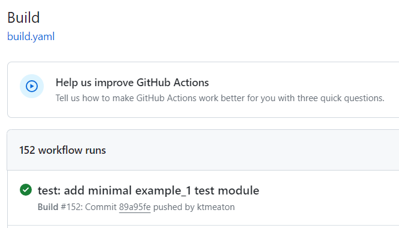
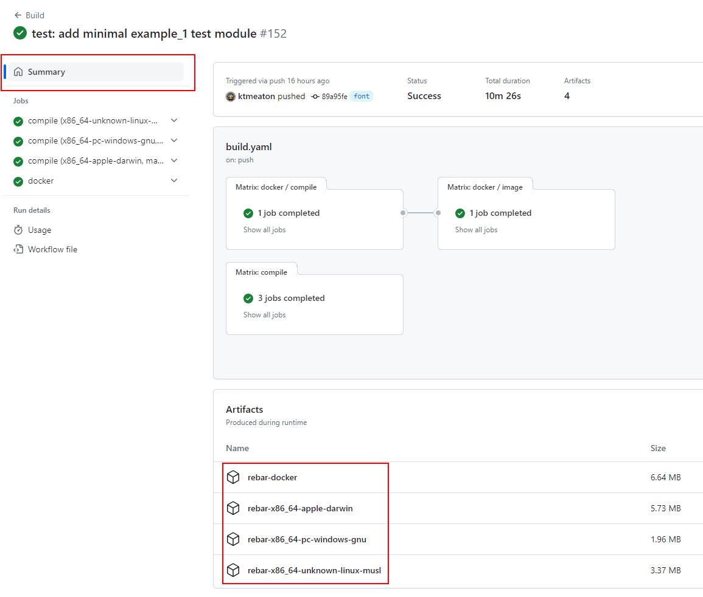
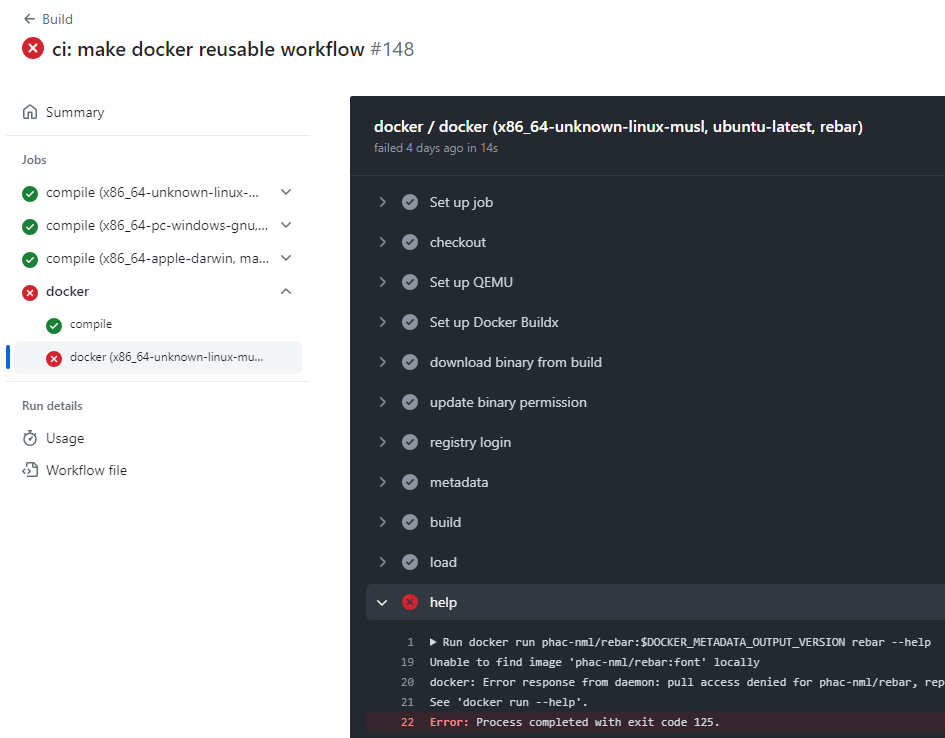

## Compile

For a consistent compilation experience, we recommend using the pre-configured [GitHub Actions](https://github.com/features/actions). The [rebar](https://github.com/phac-nml/rebar) repository will automatically compile on every `git push` using a container in GitHub's cloud architecture.

1. Create your own fork of [phac-nml/rebar](https://github.com/phac-nml/rebar).
1. Push changes to your fork.
1. Navigate to your GitHub Actions Build page.

    In the following url, replace `<USERNAME>` with your GitHub username.
    `https://github.com/<USERNAME>/rebar/actions/workflows/build.yaml`

1. Click on the most recent build workflow at the top.

    

1. Click on the `Summary` tab. If the build succeeded, the compiled binaries and docker images (zipped) will be available for download at the bottom (for 7 days).

    

1. If compilation failed, click on the steps with a ❌ to see the logs for troubleshooting.

    
