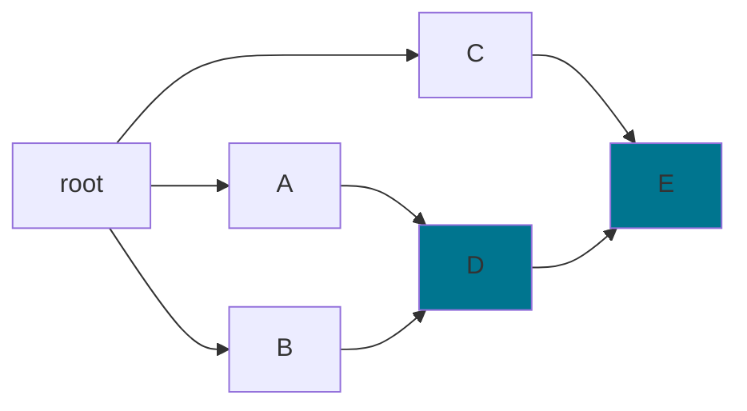
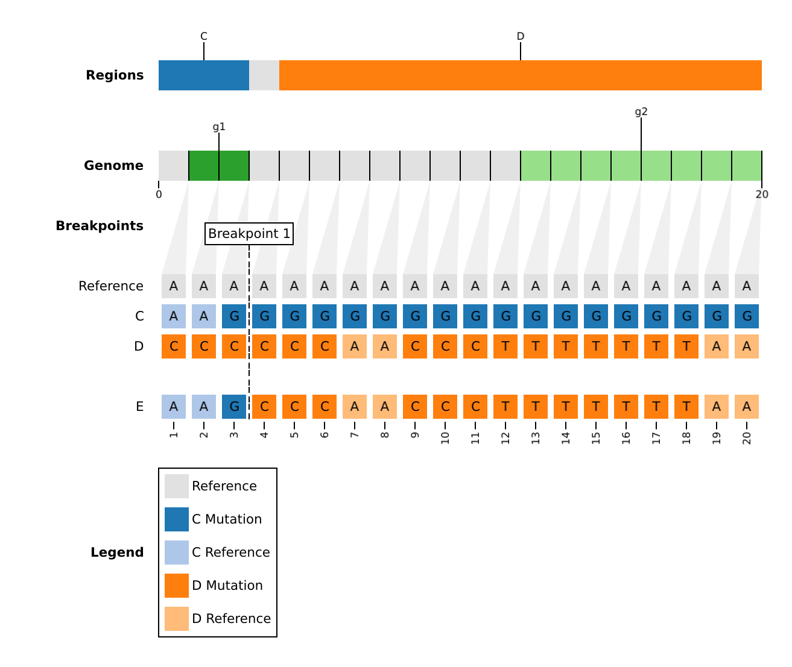
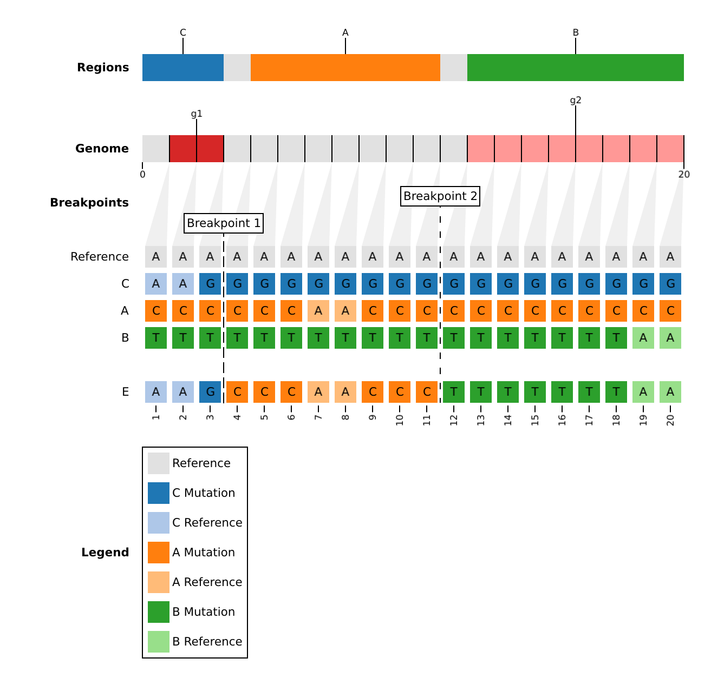

# Dataset

A minimal example dataset is provided called `toy1`, which can be downloaded with:

```bash
rebar dataset download --name toy1 --tag custom --output-dir dataset/toy1
```

## Mandatory

A `rebar` dataset consists of two mandatory parts:

1. `reference.fasta`: The reference genome.

    ```text
    >Reference
    AAAAAAAAAAAAAAAAAAAA
    ```

1. `populations.fasta`: Known populations (ex. clades, lineages) aligned to the reference.

    ```text
    >A
    CCCCCCAACCCCCCCCCCCC
    >B
    TTTTTTTTTTTTTTTTTTAA
    >C
    AAGGGGGGGGGGGGGGGGGG
    >D
    CCCCCCAACCCTTTTTTTAA
    >E
    AAGCCCAACCCTTTTTTTAA
    ```

## Optional

### Annotations

- `annotations.tsv`: A table of genome annotations to add to the plot.

|gene |abbreviation|start|end|
|:----:|:-----------:|:----:|:--:|
|Gene1|g1          |1    |3  |
|Gene2|g2          |12   |20 |

### Phylogeny

- `phylogeny.json`: A phylogenetic graph which provides prior information about the evolutionary history. This is particularly useful if populations in `populations.fasta` are internal nodes or known recombinants.

For example, an evolutionary history, in which population `D` is a recombinant, and `E` is a recursive recombinant (it has a parent that is also a recombinant).



Is represented by the following phylogenetic graph:

```json
{
  "graph": {
    "nodes": ["root", "A", "B", "C", "D", "E" ],
    "edge_property": "directed",
    "edges": [
      [ 0, 1, 1 ],
      [ 0, 2, 1 ],
      [ 0, 3, 1 ],
      [ 1, 4, 1 ],
      [ 2, 4, 1 ],
      [ 4, 5, 1 ],
      [ 3, 5, 1 ]
    ]
  }
}
```

Where `nodes` are the list of node names in the tree (internal and external), and `edges` are the branches between nodes. For example, the edge `[0, 1, 1]` connects node index 0 ("root") to node index 1 ("A") with a branch length of 1. Please note that branch lengths are not currently used in `rebar's` algorithm.

#### Phylogeny Nomenclature

- `*`: All descendants, including novel recombination.
  - `*` = A, B, C, D, E
  - `B*` = B, D, E
- `*-r`: All descendants, excluding novel recombination.
  - `*-r`: A, B, C
  - `B*-r`: B

### Edge Cases

- `edge_cases.json`: A list of `rebar` arguments to apply only to a particular population.

In the dataset, `E` is a recursive recombinant between population `C` and recombinant `D`. However, we could instead force it to be a recombinant between `A`, `B`, and `C` with the following parameters:

```json
[
  {
    "population": "E",
    "parents": [ "A", "B", "C"],
    "knockout": null,
    "mask": [0, 0],
    "max_iter": 3,
    "max_parents": 3,
    "min_parents": 3,
    "min_consecutive": 3,
    "min_length": 3,
    "min_subs": 1,
    "naive": false
  }
]
```

| Default | Edge Case |
| ---------------------------------------------------------------------------------------------------------------------------------- | --------- |
|  |           |
