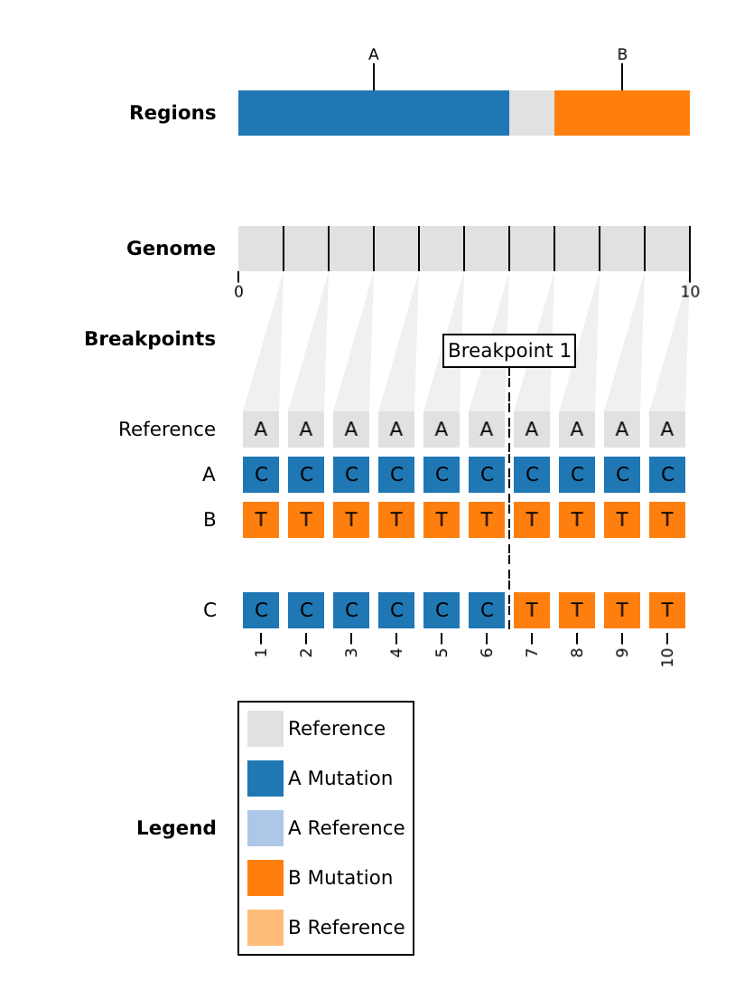

# Examples

## Example 1 | Populations

The names of SARS-CoV-2 lineages as input.

1. Detect recombination.

    ```bash
    rebar run \
      --dataset-dir dataset/sars-cov-2/2023-11-17  \
      --populations "AY.4.2*,BA.5.2,XBC.1.6*,XBB.1.5.1,XBL" \
      --output-dir output/example/population
    ```

1. Plot breakpoints and parental regions.

    ```bash
    rebar plot --dataset-dir dataset/sars-cov-2/2023-11-17 --output-dir output/example/population
    ```

The populations (`--populations`) can include any sequence name found in the dataset's `populations.fasta`. For `sars-cov-2`, sequence names are the designated lineages. The wildcard character ("\*") will include the lineage and all its descendants. **NOTE**: If using "\*", make sure to use quotes (ex. `--lineages "XBC*,XBB.1.16*"`)!

## Example 2 | Alignment

An alignment of SARS-CoV-2 genomes as input.

1. Download test data.

    ```bash
    wget https://raw.githubusercontent.com/phac-nml/rebar/main/data/example2.fasta
    ```

1. Detect recombination.

    ```bash
    rebar run \
      --dataset dataset/sars-cov-2/2023-11-17 \
      --alignment example2.fasta \
      --output-dir output/example/alignment
    ```

Please note that the `--alignment` should be aligned to the same reference as in the dataset `reference.fasta` (we strongly recommend [nextclade](https://clades.nextstrain.org/)).

## Example 3 | Debug

You can see the inner-workings of the `rebar` algorithm by using `--verbosity debug`. Let's test this on the SARS-CoV-2 recombinant `XCC` which has known parents `XBB.1.9.1` and `CH.1.1.1`.

```bash
rebar run \
    --dataset-dir dataset/sars-cov-2/2023-11-17  \
    --populations "XCC" \
    --output-dir output/example/debug \
    --verbosity debug
```

The debugging output will report detailed information on dataset searches for the primary parent (best match/conensus population). In addition, it will search for secondary parents (recombination) by testing four different recombination hypotheses:

1. Non-Recombinant
1. Designated Recombinant (using known parents from the dataset)
1. Recursive Recombinant (allowing parents to be recombinants themselves)
1. Non-Recursive Recombinant (not allowing parents to be recombinants)

The best match/primary parent is found to be for `XCC` is... itself, excellent! `XCC` is a known recombinant, so that rules out **Hypothesis \#1**.

Since `XCC` is a known recombinant, `rebar` will evaluate **Hypothesis 2**. The primary parent search will be redone focusing exclusively on designated parents (`XBB.1.9.1` and `CH.1.1.1`).

search for a secondary parent in designated parents for **Hypothesis 2** (`XBB.1.9.1` and `CH.1.1.1`.)

Since we're using a dataset population, `XCC` is an exact match to itself. So there are no mutational conflicts that need to be explained by recombination/secondary parents. No evidence for **Hypothesis #3** is found.

`rebar` will then search for a secondary parent among all possible populations. However since `XCC` is an exact match to itself, there are no mutational conflicts to

Since `XCC` is a known recombinant, `rebar` will search for a secondary parent in designated parents for **Hypothesis 2** (`XBB.1.9.1` and `CH.1.1.1`.)
`rebar` will only find evidence to support Hypotheses \#2 (designated) and \#4 (recursive).

```text
Hypotheses: DesignatedRecombinant: score=66, conflict=3, RecursiveRecombinant: score=66, conflict=3
```

Hypotheses: DesignatedRecombinant: score=66, conflict=3, RecursiveRecombinant: score=66, conflict=3

DesignatedRecombinant: score=78, conflict=0, NonRecursiveRecombinant: score=49, conflict=6

## Example 3 | Knockout

You can perform a 'knockout' experiment to remove populations from the dataset. For example, we might be interested in what the SARS-CoV-2 recombinant `XBB` would have been classified as _before_ it became a designated lineage.

1. Detect recombination.

    ```bash
    rebar run \
      --dataset-dir dataset/sars-cov-2/2023-11-17  \
      --populations "XBB" \
      --knockout "XBB" \
      --output-dir output/example/knockout
    ```

1. Examine the linelist (`output/example3/linelist.tsv`).

    |strain        |validate|validate_details|population|recombinant|parents     |breakpoints|edge_case|unique_key                    |regions                             |substitutions                                                                                                                                                                                             |genome_length|dataset_name|dataset_tag|cli_version|
    |:-------------|:-------|:---------------|:---------|:----------|:-----------|:----------|:--------|:-----------------------------|:-----------------------------------|:------------------------------------------------------------------------------------------------------------------------------------------------------------------------------------------------------------------------------------------------------------------------------------------------------------------------------------------------------------------------------------------------------------------------------------------|:------------|:-----------|:----------|:----------|
    |population_XBB|        |                |BJ.1      |novel      |BJ.1,BA.2.75|22897-22941|false    |novel_BJ.1_BA.2.75_22897-22941|405-22896\|BJ.1,22942-29118\|BA.2.75|A405G,T670G,C2790T,C3037T,G4184A,C4321T,C9344T,A9424G,C9534T,C9866T,C10029T,C10198T,G10447A,C10449A,C12880T,C14408T,G15451A,C15714T,C15738T,T15939C,T16342C,C17410T,T17859C,A18163G,C19955T,A20055G,C21618T,T21810C,G21987A,C22000A,C22109G,T22200A,G22577C,G22578A,G22599C,C22664A,C22674T,T22679C,C22686T,A22688G,G22775A,A22786C,G22813T,T22882G,G22895C,T22896C\|BJ.1;T22942G,T23019C,T23031C,C25416T,A26275G\|BA.2.75;A19326G\|private|29903        |sars-cov-2  |2023-11-17 |0.1.0      |

- `XBB` is found to be a descendant of `BJ.1` (`BA.2.10.1.1`), specifically a novel recombinant between `BJ.1` and `BA.2.75`.
- The `substitutions` column reveals that it gained 5 substitutions from the `BA.2.75` parent: `T22942G`, `T23019C`, `T23031C`, `C25416T`, `A26275G`.
- In addition, it has one "private" substitutions that is not found in either parent: `A19326G`.
- This can be used to contribute evidence for a new lineage proposal in the [pango-designation](https://github.com/cov-lineages/pango-designation/issues) respository.

## Example 4 | Parents

By default, `rebar` will consider all populations in the dataset as possible parents. If you would like to see the evidence for a specific hypothesis, you can restrict the parent search with `--parents`.

1. Detect recombination.

    ```bash
    rebar run \
      --dataset-dir dataset/sars-cov-2/2023-11-17  \
      --populations "XD" \
      --output-dir output/example/parents \
      --verbosity debug
    ```

["B.1.617.2*","BA.1*"]

## Example 4 | Validate

Run `rebar` on all populations in the dataset, and validate against the expected results.

1. Detect recombination.

    ```bash
    rebar run \
        --dataset-dir dataset/sars-cov-2/latest \
        --output-dir output/validate \
        --populations "*" \
        --threads 4
    ```

## Example 5 | Custom Dataset

1. Download the `toy1` dataset.

    ```bash
    wget https://raw.githubusercontent.com/phac-nml/rebar/main/dataset/toy1.zip
    unzip toy1.zip -d dataset/
    ```

1. Detect recombination.

    ```bash
    rebar run \
      --dataset-dir dataset/toy1 \
      --populations "*" \
      --output-dir output/example5 \
      --mask 0,0 \
      --min-length 3
    ```

    - `--mask 0,0`: mask 0 bases at the 5' end, and 0 bases at the 3' end
    - `--min-length 3`: a parental region must be at minimum 3 bases in length.

1. Plot.

    ```bash
    rebar plot --dataset-dir dataset/toy1 --output-dir output/example5
    ```

    
